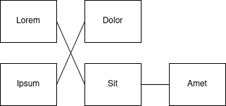
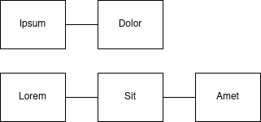

# DF Designer Frontend Vacancy - Coding Challenge

Your task will be to write a React based application, either in TypeScript or JavaScript (altough the former will be preferred). The application should:

1. Fetch a list of available graphs from `/api/graphs` via a `GET` request.
2. Fetch the selected graph data from `/api/graphs/:id` via a `GET` request.
3. Organize nodes into columns.
4. "Untangle" the connection between the columns of nodes.
5. Render the graph into the DOM.

For more details, read through this file.

## Getting started

 1. Run `npm install`
 2. (Optional) If you prefer to use JS, change `src/*.tsx` to `src/*.jsx` and change `src="/src/main.tsx"` in `index.html` to `src="/src/main.jsx"`
 3. Run `npm start` to run the dev server
 4. Write your app in `src/App.{tsx,jsx}`
 5. Run `npm test` to see if your solution passes the test suite

 If there are any issues with the environment, you are getting errors while trying to run any of these command, please open an issue on the repository.


## Checklist before submitting

 - [ ] There is a dropdown to select one graph to show from all the available graphs
 - [ ] The selected graph is immediately rendered
 - [ ] The rendered graph is organized into columns
 - [ ] The nodes in columns are ordered such that their edges cross as little as possible
 - [ ] The graph looks visually pleasing
 - [ ] **Your solution passes the test suite** (`npm test`)

**Extra challenge**

 - [ ] Make the nodes draggable with the mouse without using a library.

## The API and the data format

All endpoints return JSON data on success. Errors may be simple text replies.

The `/api/graphs` endpoint lists a number of (predefined) graphs in this format:

```typescript
interface GraphsList {
  graphs: number[]; // IDs of the available graphs
}
```

The `/api/graphs/:id` endpoint returns a JSON document with the following structure:

```typescript
interface Graph {
  // Feel free to split these out into separate interfaces if you're using TS
  nodes: {
    id: number; // Unique id of the node
    name: string; // String name of the node which should be displayed
  }[];
  edges: {
    fromId: number; // Id of the node from which the edge starts
    toId: number; // Id of the node to which the edge leads
   }[];
}
```
## Graph layout

Your application should compute a layout for the received graph.

 1. First, you should organize the nodes into separate columns. In the first column, you place nodes that only have outgoing connections. In the second, you put nodes that connect to the first column and so on, like so:
 


 2. Next, you should reorder nodes within columns such that the edges between them cross each other as little as possible:



Ideally, you should implement the layout inside one or more custom React hook.

## Graph rendering

You should display the layouted graph in the DOM. 
 - You may simply use `div`s for the nodes and render the edges with SVG, for example. 
 - You should use CSS to make the graph look as nice as possible.

